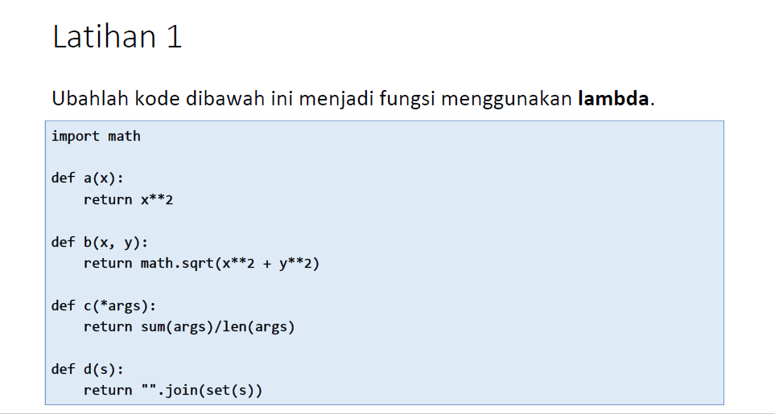

# Pertemuan10-Lab6

Repository ini dibuat untuk memenuhi tugas bahasa pemrograman pertemuan 10 lab 6<br><br>
Nama : Mohamad Farizal Arifin <br>
NIM : 312010231<br>
Dosen : Agung Nugroho, M.Kom<br>
Matkul : Bahasa Pemrograman<br>
Kelas : TI.20.B.1<br>

Pada materi kali ini pertemuan-10 Lab-6 Dosen memberi tugas sebagai berikut :<br>
* Soal Latihan pada Lab 6<br>
<br>
* Dan seperti ini lah saya membuat code untuk memenuhi tugas latihan lab 6<br>
```python
import math

print("===================================================================")
print("Nama : Mohamad Farizal Arifin")
print("NIM : 312010231")
print("Kelas : TI.20.B1")
print("Mata Kuliah : Bahasa Pemrograman")
print("===================================================================")

def a(x):
    return x ** 2

#Lambda
def a2(x): x ** 2

print("Ubahlah kode dibawah ini menjadi fungsi menggunakan lambda \n   def a(x): \n \t   return x ** 2")
print("Lambda : def a2(x): x ** 2")


def b(x, y):
    return math.sqrt(x ** 2 + y ** 2)

#Lambda
def b2(x, y): math.sqrt(x ** 2 + y ** 2)

print("Ubahlah kode dibawah ini menjadi fungsi menggunakan lambda \n   def b(x, y): \n \t   return math.sqrt(x ** 2 + y ** 2)")
print("Lambda : def b2(x, y): math.sqrt(x ** 2 + y ** 2)")


def c(*args):
    return sum(args) / len(args)

#Lambda
def c2(*args): sum(args) / len(args)

print("Ubahlah kode dibawah ini menjadi fungsi menggunakan lambda \n   def c(*args): \n \t   return sum(args) / len(args)")
print("Lambda : def c2(*args): sum(args) / len(args)")


def d(s):
    return "".join(set(s))

#Lambda
def d2(s): "".join(set(s))

print("Ubahlah kode dibawah ini menjadi fungsi menggunakan lambda \n   def d(s): \n \t   return "".join(set(s))")
print("Lambda : def d2(s): "".join(set(s))")